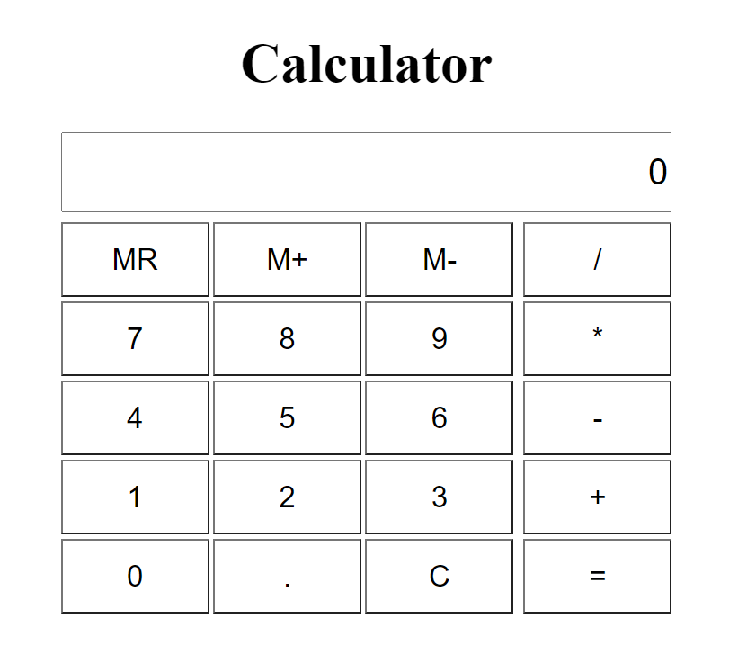

# Calculator App
A simple and clean calculator application written entirely in Vanilla JavaScript, HTML and CSS

Code Located [Here](https://github.com/hcuellar-coder/CalculatorApp)

Run Code [Here](https://hcuellar-coder.github.io/CalculatorApp/)

## Summary
This calculator application has memory functionality and sleek design. It was a challenge to take into account all the different functionalities that we take for granted of the simple calculator. Standing on the shoulders of giants, I was able to use Vanilla Javascript, HTML and CSS to create a working calcualtor applicaiton. It also uses the local storage for its memory functionality. It was a fun challenge and enjoyed making it. 

## Author
Heriberto Cuellar – Full Stack Software Developer - [LinkedIn](https://www.linkedin.com/in/heriberto-c-5aa11952)